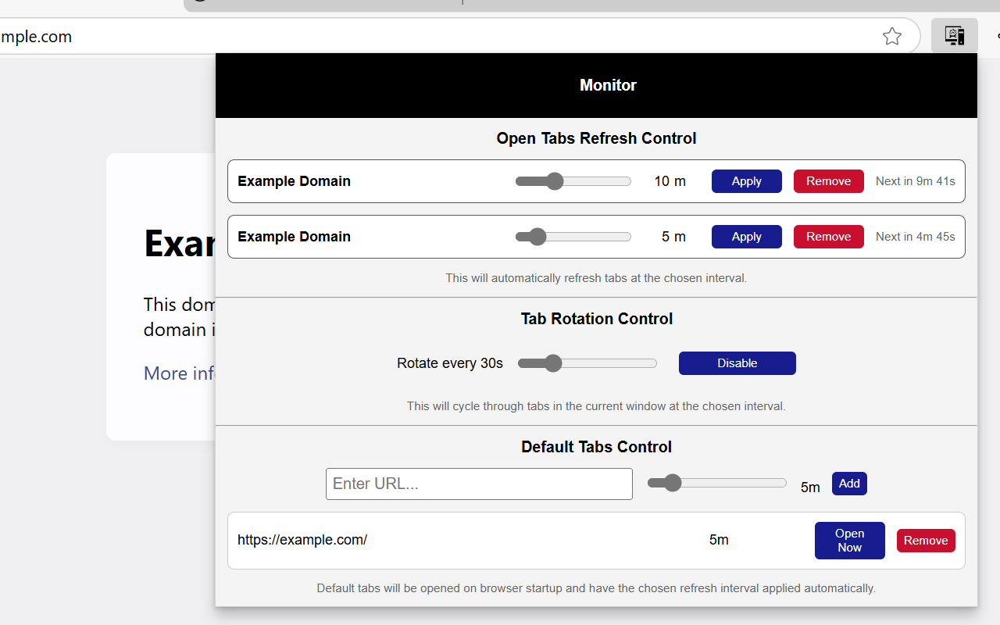

# 🖥️ Monitor — A Simple Tab Management Tool for Monitoring & Service Desks

**Monitor** is a simple, open-source browser extension built for **rotating and refreshing browser tabs** — without the bloat, spyware, or ads.

Perfect for:

- 👮 Security Operations Centers (SOCs)  
- 🧰 IT Service Desks  
- 📊 Dashboard Displays & Wallboards  
- 🏥 Clinical Support Terminals  
- 🏢 Reception Counters  
- 🧪 Lab & QA Environments  
- 📺 Kiosk & Info Screens  
- 🖥️ Dev/Test Workstations

> ⚠️ **Why this exists:**  
> Many browser extensions that offer tab refreshing and rotation are bloated or **malicious** — injecting ads, crypto miners, or tracking scripts. **Monitor** is designed to be simple, safe, and open.



---

## ✨ Features

- ✅ **Auto-Refresh Tabs** — Set a custom refresh interval (in minutes) for any tab.  
- 🚀 **Default Tabs** — Automatically open key tabs with specified refresh intervals when a new window is launched.  
- 🔄 **Tab Rotation** — Seamlessly switch between tabs every X seconds — great for dashboards or kiosk displays.  
- 🧼 **No Tracking** — No analytics, no server communication, no nonsense.  
- 🎯 **Minimal UI** — Clean, no-clutter popup to manage everything.  
- 💾 **Persistent** — Settings are saved between sessions via `chrome.storage.local`.  
- 🧱 **Cross-Browser** — Works with Chrome, Edge, Brave, and other Chromium browsers.

---

## 📥 Installation

### 🔗 Web Store (Coming Soon)

> Will be available on:  
> [Chrome Web Store](#)  
> [Edge Add-ons](#)

---

### 💻 Manual Installation (for local testing or air-gapped environments)

1. **Download or clone** the repo:
   ```bash
   git clone https://github.com/your-org/monitor-extension.git
   cd monitor-extension
